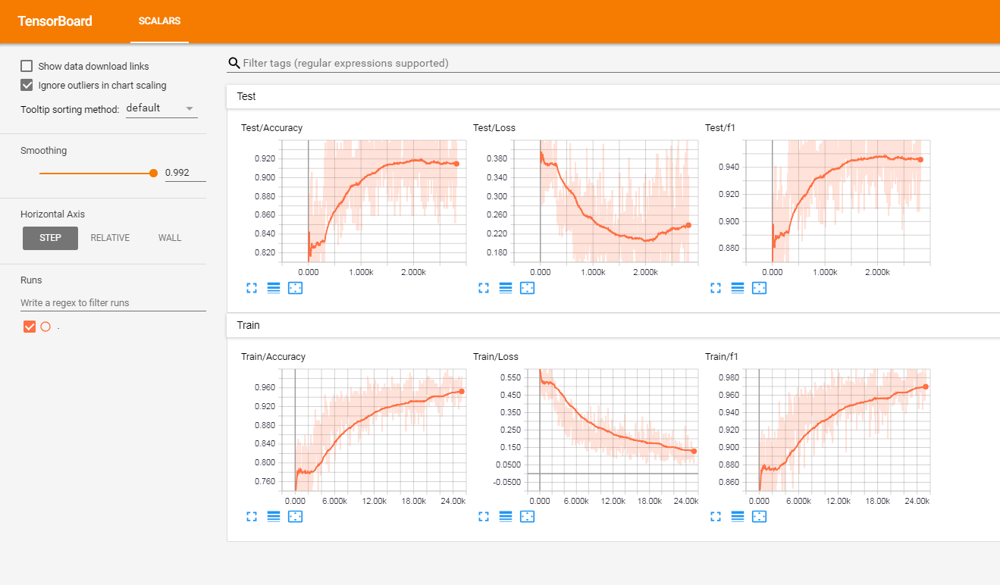

## Character Based CNN

[](https://github.com/ahmedbesbes/character-based-cnn/blob/master/LICENSE)
[](https://github.com/ahmedbesbes/character-based-cnn/issues)
[](https://twitter.com/ahmed_besbes_)
[](https://github.com/ahmedbesbes/character-based-cnn/stargazers)


This repo contains a PyTorch implementation of a character-level convolutional neural network for text classification.

The model architecture comes from this paper: https://arxiv.org/pdf/1509.01626.pdf


There are two variants: a large and a small. You can switch between the two by changing the configuration file.

This architecture has 6 convolutional layers:

|Layer|Large Feature|Small Feature|Kernel|Pool|
|-|-|-|-|-|
|1|1024|256|7|3|
|2|1024|256|7|3|
|3|1024|256|3|N/A|
|4|1024|256|3|N/A|
|5|1024|256|3|N/A|
|6|1024|256|3|3|

and 2 fully connected layers:

|Layer|Output Units Large|Output Units Small|
|-|-|-|
|7|2048|1024|
|8|2048|1024|
|9|Depends on the problem|Depends on the problem|

## Video tutorial

If you're interested in how character CNN work as well as in the demo of this project you can check my youtube video tutorial.


<p align="center">
  <a href="https://www.youtube.com/watch?v=CNY8VjJt-iQ">
    
  </a>
</p>

## Why you should care about character level CNNs

They have very nice properties:

- They are quite powerful in text classification (see paper's benchmark) even though they don't have any notion of semantics
- You don't need to apply any text preprocessing (tokenization, lemmatization, stemming ...) while using them
- They handle misspelled words and OOV (out-of-vocabulary) tokens
- They are faster to train compared to recurrent neural networks
- They are lightweight since they don't require storing a large word embedding matrix. Hence, you can deploy them in production easily


## Training a sentiment classifier on french customer reviews

I have tested this model on a set of french labeled customer reviews (of over 3 millions rows). I reported the metrics in TensorboardX. 

I got the following results

||F1 score|Accuracy|
|-|-|-|
|train|0.965|0.9366|
|test|0.945|0.915|



## Dependencies

- numpy 
- pandas
- sklearn
- PyTorch 0.4.1
- tensorboardX
- Tensorflow (to be able to run TensorboardX)

## Structure of the code

At the root of the project, you will have:

- **train.py**: used for training a model
- **predict.py**: used for the testing and inference
- **config.json**: a configuration file for storing model parameters (number of filters, neurons)
- **src**: a folder that contains:
  - **cnn_model.py**: the actual CNN model (model initialization and forward method)
  - **data_loader.py**: the script responsible of passing the data to the training after processing it
  - **utils.py**: a set of utility functions for text preprocessing (url/hashtag/user_mention removal)

## How to use the code

### Training

**The code currently works only on binary labels (0/1)**

Launch train.py with the following arguments:

- `data_path`: path of the data. Data should be in csv format with at least a column for text and a column for the label
- `validation_split`: the ratio of validation data. default to 0.2
- `label_column`: column name of the labels
- `text_column`: column name of the texts 
- `max_rows`: the maximum number of rows to load from the dataset. (I mainly use this for testing to go faster)
- `chunksize`: size of the chunks when loading the data using pandas. default to 500000
- `encoding`: default to utf-8
- `steps`: text preprocessing steps to include on the text like hashtag or url removal
- `group_labels`: whether or not to group labels. Default to None.
- `use_sampler`: whether or not to use a weighted sampler to overcome class imbalance
- `alphabet`: default to abcdefghijklmnopqrstuvwxyz0123456789,;.!?:'\"/\\|_@#$%^&*~\`+-=<>()[]{} (normally you should not modify it)
- `number_of_characters`: default 70
- `extra_characters`: additional characters that you'd add to the alphabet. For example uppercase letters or accented characters
- `max_length`: the maximum length to fix for all the documents. default to 150 but should be adapted to your data
- `epochs`: number of epochs 
- `batch_size`: batch size, default to 128.
- `optimizer`: adam or sgd, default to sgd
- `learning_rate`: default to 0.01
- `class_weights`: whether or not to use class weights in the cross entropy loss
- `focal_loss`: whether or not to use the focal loss
- `gamma`: gamma parameter of the focal loss. default to 2 
- `alpha`: alpha parameter of the focal loss. default to 0.25
- `schedule`: number of epochs by which the learning rate decreases by half (learning rate scheduling works only for sgd), default to 3. set it to 0 to disable it
- `patience`: maximum number of epochs to wait without improvement of the validation loss, default to 3
- `early_stopping`: to choose whether or not to early stop the training. default to 0. set to 1 to enable it.
- `checkpoint`: to choose to save the model on disk or not. default to 1, set to 0 to disable model checkpoint
- `workers`: number of workers in PyTorch DataLoader, default to 1
- `log_path`: path of tensorboard log file
- `output`: path of the folder where models are saved
- `model_name`: prefix name of saved models

Example usage:

```bash
python train.py --data_path=/data/tweets.csv --max_rows=200000
```

### Plotting results to TensorboardX

Run this command at the root of the project:

```bash
tensorboard --logdir=./logs/ --port=6006
```

Then go to: http://localhost:6006 (or whatever host you're using)

### Prediction

Launch predict.py with the following arguments:

- `model`: path of the pre-trained model
- `text`: input text
- `steps`: list of preprocessing steps, default to lower
- `alphabet`: default to 'abcdefghijklmnopqrstuvwxyz0123456789-,;.!?:\'"\\/|_@#$%^&*~`+-=<>()[]{}\n'
- `number_of_characters`: default to 70
- `extra_characters`: additional characters that you'd add to the alphabet. For example uppercase letters or accented characters
- `max_length`: the maximum length to fix for all the documents. default to 150 but should be adapted to your data

Example usage:

```bash
python predict.py ./models/pretrained_model.pth --text="I love pizza !" --max_length=150

```

## Download pretrained models

- Sentiment analysis model on French customer reviews (3M documents): [download link](https://drive.google.com/file/d/1pmzeac-Vx07ScBL0S-xJ5EqRJYGdtWvh/view?usp=sharing)

  When using it:
  - set max_length to 300
  - use extra_characters="éàèùâêîôûçëïü" (accented letters)

## Contributions - PR are welcome:

Here's a non-exhaustive list of potential future features to add:

- Adapt the loss for multi-class classification 
- Log training and validation metrics for each epoch to a text file
- Provide notebook tutorials

## License

This project is licensed under the MIT License
