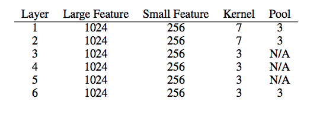
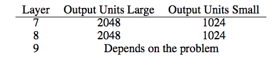

# Character Based CNN

This repo contains a PyTorch implementation of a character-level convolutional neural network for text classification.

The model architecture comes from this paper: https://arxiv.org/pdf/1509.01626.pdf

There are two variants: a large and a small. You can switch between by changing the configuration file.

There are basically 6 convolutional layers:

and and 2 fully connected layers:

# Why you should care about character level CNNs

- They are quite powerful in text classification (see paper's benchmark) iven though they have no notion of semantics
- You don't need to apply any text preprocessing (tokenization, lemmatization, stemming ...) while using them
- They handle misspelled words and OOV (out-of-vocabulary) tokens very well when testing
- They are faster to train compared to recurrent networks
- They are lightweight since they don't require storing a large word embedding matrix, hence you can deploy them in production more easily

# Results

I have tested this model on a set of french labeled customer reviews (of over 3 millions rows). I reported the metrics in TensorboardX. 

The results are petty amazing: the F1 score is over 0.94 on the test set.

# Dependencies

- numpy 
- pandas
- sklearn
- PyTorch 0.4.1
- tensorboardX

# Structure of the code

At the root of the project, you will have:

- **train.py**: used for training a model
- **predict.py**: used for the testing and inference
- **config.json**: a configuration file for storing model parameters (number of filters, neurons)
- **src**: a folder that contains:
  - **cnn_model.py**: the actual CNN model (model initialization and forward method)
  - **data_loader.py**: the script responsible of passing the data to the training after processing it
  - **utils.py**: a set of utility functions for text preprocessing (url/hashtag/user_mention removal)

# How to use the code

For training:

For testing:

